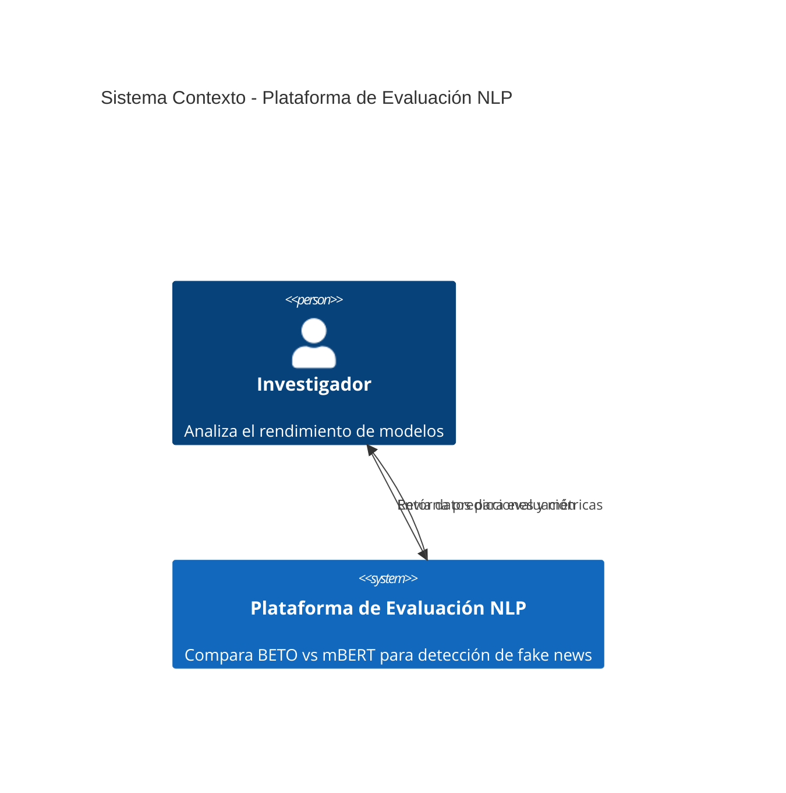
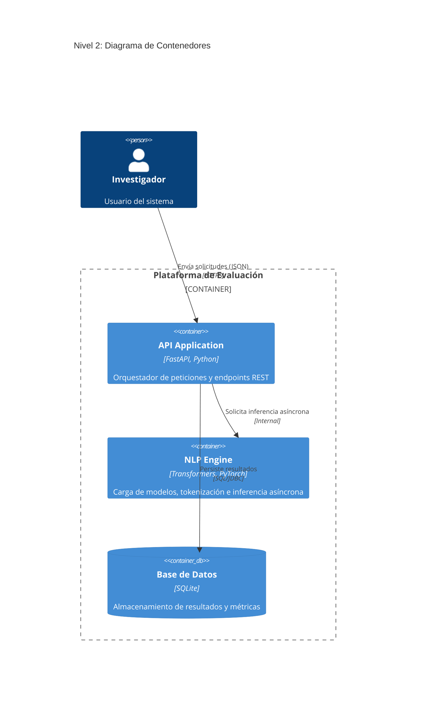

# Diseño de Arquitectura: Plataforma de Evaluación Comparativa BETO vs mBERT

Este documento define la arquitectura para la plataforma de evaluación comparativa de modelos de lenguaje, enfocada en la detección de noticias falsas en español. El sistema permitirá comparar objetivamente el rendimiento de BETO (Spanish BERT) y mBERT (Multilingual BERT).

## 1. Nivel 1: Diagrama de Contexto del Sistema (System Context)

El sistema actúa como una plataforma centralizada donde un investigador de datos puede enviar textos y recibir diagnósticos comparativos entre modelos NLP.

## 2. Nivel 2: Diagrama de Contenedores (Container Diagram)

El sistema se descompone en los siguientes contenedores tecnológicos:

### Descripción de Contenedores

*   **API Application (FastAPI):** Puerta de entrada. Gestiona las peticiones REST, valida esquemas de entrada (Pydantic) y orquesta la lógica.
*   **NLP Engine (Transformers):** Motor central. Responsable de la carga de modelos BETO/mBERT, preprocesamiento y ejecución de inferencia en modo asíncrono para no bloquear el servidor.
*   **Base de Datos (SQLite):** Almacenamiento persistente. Guarda la trazabilidad de cada diagnóstico: texto, etiqueta real, predicciones de ambos modelos y tiempos de respuesta.
*   **Entorno de Despliegue (Docker):** Empaquetado mediante Docker y Docker Compose para asegurar consistencia en ejecución (API + Motor NLP en un contenedor, Base de Datos en volúmenes persistentes).

## 3. Objetivos y Fuera de Alcance

**Objetivos:**
- Plataforma unificada de comparación de BETO vs mBERT en detección de fake news en español.
- Procesamiento asíncrono para alta escalabilidad.
- Persistencia de resultados para análisis histórico.
- Endpoints REST para integración.

**Fuera de Alcance:**
- Entrenamiento de modelos.
- Interfaz Frontend (solo API).
- Procesamiento en streaming.

## 4. Decisiones Técnicas
- **Arquitectura:** Capas (API -> Negocio -> Datos).
- **Procesamiento:** Inferencia asíncrona (`async/await`) en FastAPI.
- **Validación:** Uso estricto de Pydantic.
- **Persistencia:** SQLite para simplicidad operativa inicial.

## 5. Riesgos y Compensaciones
*   **Huella de Memoria:** Los modelos NLP son pesados; mitigación mediante gestión estricta de caché de modelos en Docker.
*   **Escalabilidad:** Se evaluará el *batching* de peticiones si el throughput de la API decrece.
*   **Migración:** La capa de acceso a datos está desacoplada para facilitar migraciones futuras a sistemas como PostgreSQL.

## 6. Plan de Migración
1.  **Fase de Desarrollo:** Estructura, Dockerización y pipeline de datos.
2.  **Fase de Implementación Core:** Integración con Transformers.
3.  **Fase de Funcionalidades:** Cálculo de métricas y almacenamiento.
4.  **Fase de Despliegue:** Validación y documentación final.

## 7. Preguntas Abiertas
*   ¿Límite máximo de tokens para evitar OOM?
*   ¿Requerimientos específicos de hardware (GPU) para inferencia en producción?
