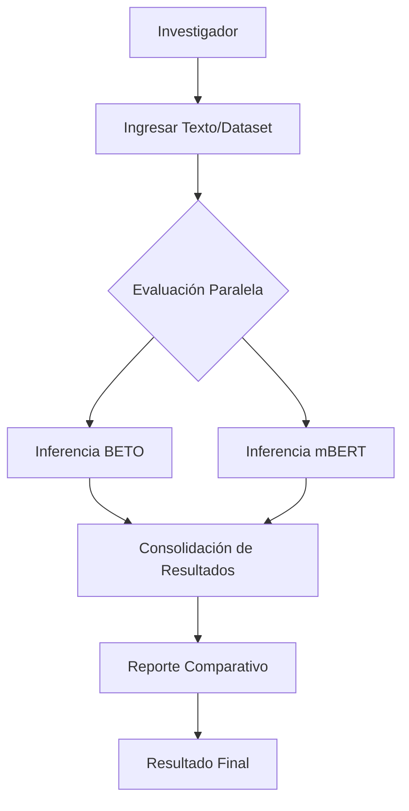
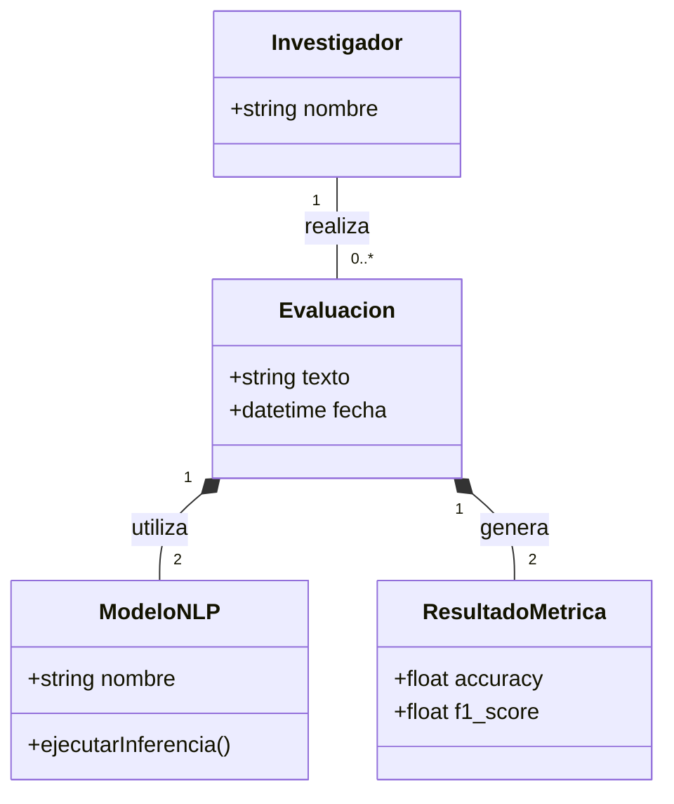
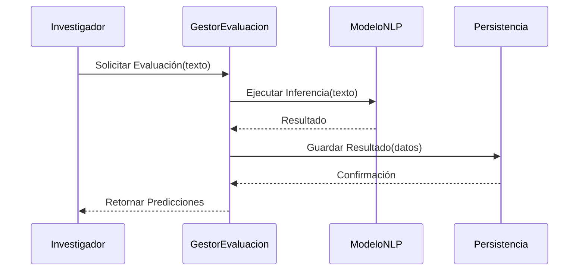
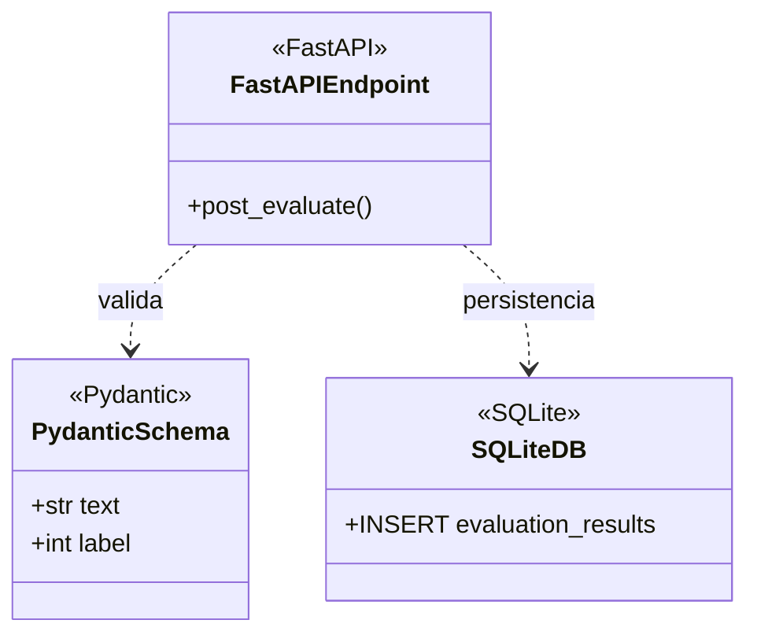
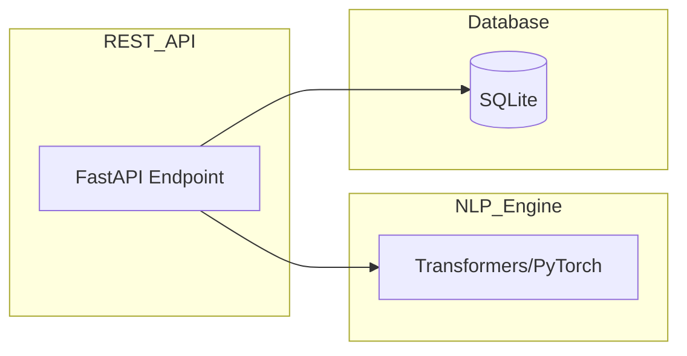
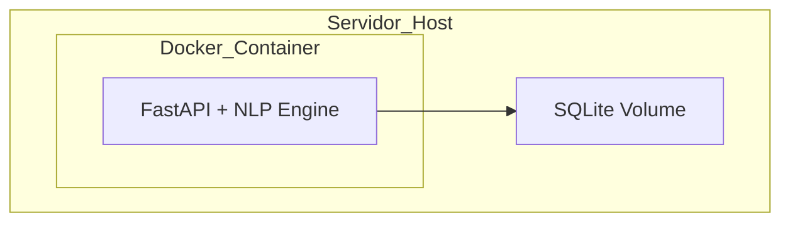

# Modelado MDA: Plataforma de Evaluación de Fake News (BETO vs mBERT)

Este archivo contiene la documentación visual del sistema desglosada según los niveles MDA (CIM, PIM, PSM).

---

## NIVEL CIM (Negocio)

### Diagrama 1: Flujo de Proceso de Negocio


### Diagrama 2: Casos de Uso
```mermaid
usecaseDiagram
    actor "Investigador" as Inv
    usecase "Evaluar Texto" as UC1
    usecase "Consultar Historial" as UC2
    usecase "Exportar Resultados" as UC3
    
    Inv --> UC1
    Inv --> UC2
    Inv --> UC3
```

---

## NIVEL PIM (Lógico)

### Diagrama 3: Clases Conceptual (Dominio)


### Diagrama 4: Secuencia "Evaluar Texto"


### Diagrama 5: Actividad de Consolidación
```mermaid
activityDiagram
    start
    :Recibir predicciones BETO y mBERT;
    :Calcular métricas individuales;
    :Consolidar tiempos de inferencia;
    :Comparar rendimiento;
    :Generar objeto consolidado;
    stop
```

---

## NIVEL PSM (Específico de Plataforma)

### Diagrama 6: Clases Tecnológico (PSM)


### Diagrama 7: Componentes Tecnológicos


### Diagrama 8: Despliegue

